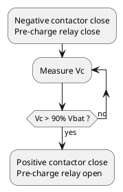

<style>
  .box {width:60%; text-align:center; font-size:10px; margin:0 auto;}
  .box img {border-radius: 10px;}
</style>

Last week I met a new issue with our vehicle: pre-charge failure. The behavior was that the negative contactor and the pre-charge relay closed then open after turn on the key. After checking the whole pre-charge circuit I found that the pre-charge resistor was damaged. 

<div class="box">
  
  Pre-charge resistor
</div>

This is the first time that a pre-charge failure has occurred， and of course it caught my attention.

## Principle and function of pre-charge circuit

In the power system of an EV, the power battery is connected to a lot of high voltage components via PDU(Power Distribution Unit), such as the motor controller, OBC, DC converter, A/C(Air Condition), PTC and so on. Usually in these components there are capacitor, especially in the motor controller, the capacity of capacitor could over 2000uF. If the initial capacity is zero, once power on, it is equivalent to a short circuit, and the current is so large that the battery, contactor and others components will be damaged. Therefore, a pre-charge circuit is necessary for the power system to protect the main contactor, motor controller and so on.
<div class="box">
  
  Pre-charge circuit
</div>
The above is a typical pre-charge circuit, it is composed by a relay and a resistor. When the power is on, the pre-charge relay was closed before the positive contactor, and the current was limited by the pre-charge resistor. As long as the voltage of capacitor goes up to 90% ~ 95% of the battery voltage, the positive contactor will be closed and the pre-charge relay will be opened. <br/>



This is a typical first-order $ RC $ series circuit. Assuming that the capacity was zero at the beginning, due to the KVL function we got:

$$ U_{Bat} = RC{dU_c \over dt} + U_c $$
Then:

$$ U_c = U_{Bat} - U_{Bat}e^{-{t \over \tau}} = U_{Bat}(1 - e^{-{t \over \tau}})$$

Where:

$$ \tau = RC $$

Thus:

 ```math
t = RC, U_c = 0.63U_{Bat} \\
t = 2RC, U_c = 0.86U_{Bat} \\
t = 3RC, U_c = 0.95U_{Bat} \\
t = 4RC, U_c = 0.98U_{Bat} \\
t = 5RC, U_c = 0.99U_{Bat} \\
 ```

At this point, it is concluded that after 3 ~ 5 $ RC $ period, the charging process is over.

## The regular basis for the pre-charge resistor selection

For the selection of pre-charge resistor, specifically, it includes three parameters: resistance $ R $, average power $ P_A $, and peak power $ P_P $. Others input parameters such as pre-charge time, capacitance value, and battery voltage are known.

Assuming that the voltage of power battery in full charge is $ 500V $, the capacitance of the capacity in motor controller is $ 2000\mu F $, the pre-charge time is $ 1s $, which is:

```math
t = 1s \\
C = 2000\mu F \\
V_{Bat} = 500V
```

### Compute the resistance

According to the above equation, we stipulate that the capacity has been charged after $ 3RC $ time, which is: $$ 3RC = 1 $$ thus:

$$ R = {1 \over 3C} = {1 \over 3 * 2000 * 10^{-6} } = 166.7 \Omega $$

### Compute the average power

The average power of the pre-charge resistor is: 

$$ P_A = {E_C \over t} $$

where $ E_C = {1 \over 2}CU_C^2 $, $ t = 1s \, and \, U_C = U_{Bat} $.

thus:

$$ P_A =  {E_C \over t} = {1 \over 2}CU_C^2 = 0.5 * 2000 * 10^{-6} * 500^2 = 250W$$

### Compute the peak power

The peak power occurs when the capacitor is zero:

$$ P_P = {U_{Bat}^2 \over R} = {500^2 / 166.7} = 1499.7W $$

## Simulation

Now let us verify the theory calculation above via simulation module.
