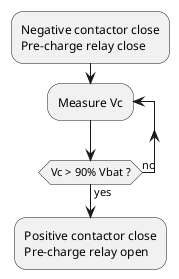

Last week I met a new issue with our vehicle: pre-charge failure. The behavior was that the negative contactor and the pre-charge relay closed then open after turn on the key. After checking the whole pre-charge circuit I found that the pre-charge resistor was damaged. This is the first time that a pre-charge failure has occurred， and of course it caught my attention.

## Principle and function of pre-charge circuit

In the power system of an EV, the power battery is connected to a lot of high voltage components via PDU(Power Distribution Unit), such as the motor controller, OBC, DC converter, A/C(Air Condition), PTC and so on. Usually in these components there are capacitor, especially in the motor controller, the capacity of capacitor could over 2000uF. If the initial capacity is zero, once power on, it is equivalent to a short circuit, and the current is so large that the battery, contactor and others components will be damaged. Therefore, a pre-charge circuit is necessary for the power system to protect the main contactor, motor controller and so on.

  
  Pre-charge circuit

The above is a typical pre-charge circuit, it is composed by a relay and a resistor. When the power is on, the pre-charge relay was closed before the positive contactor, and the current was limited by the pre-charge resistor. As long as the voltage of capacitor goes up to 90% ~ 95% of the battery voltage, the positive contactor will be closed and the pre-charge relay will be opened.  

